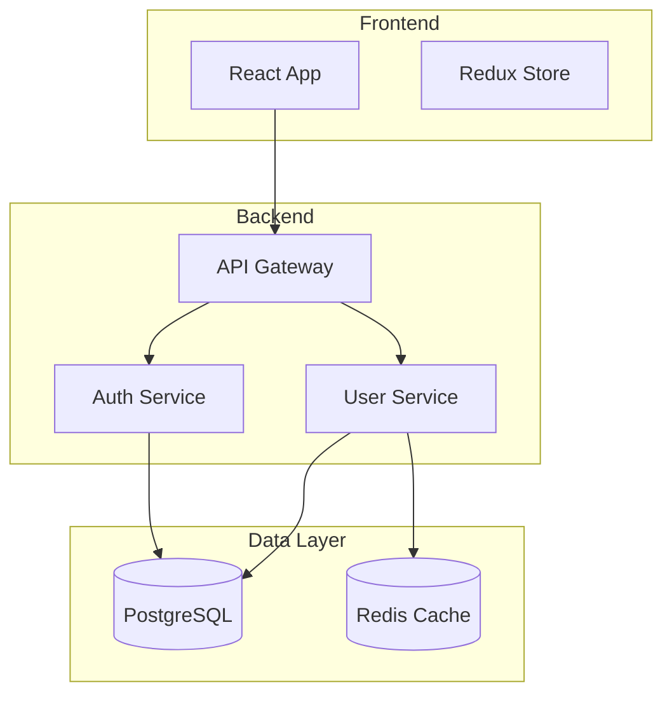
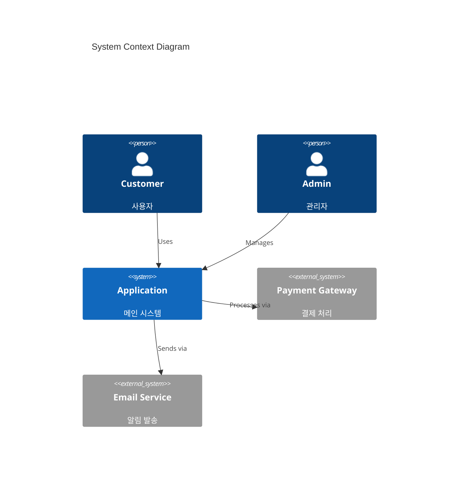
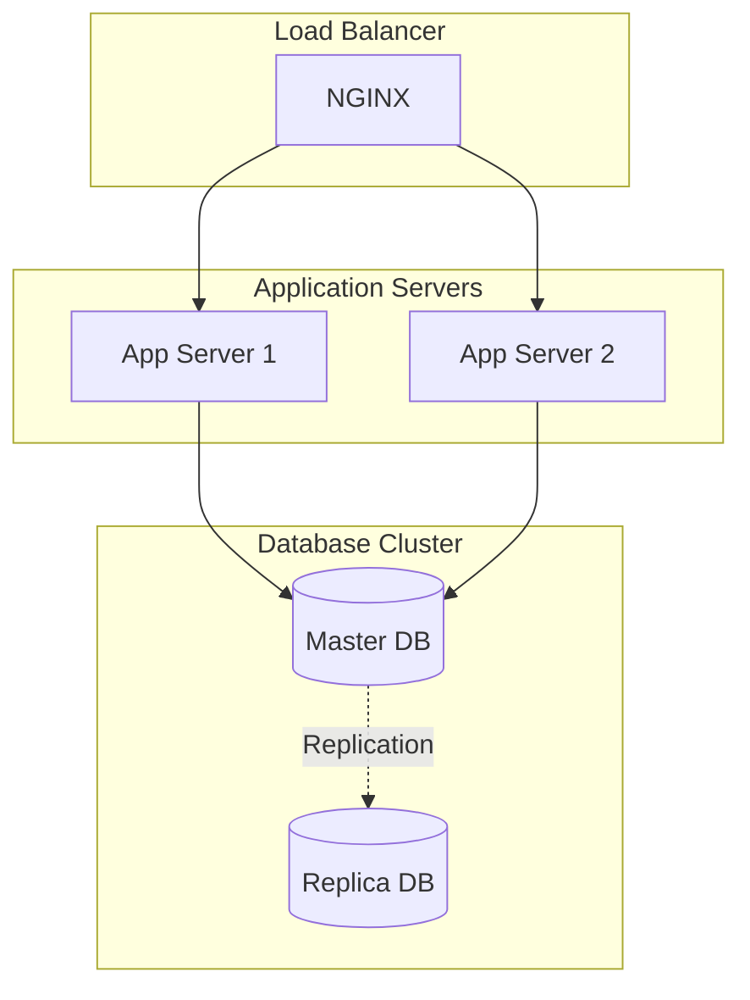
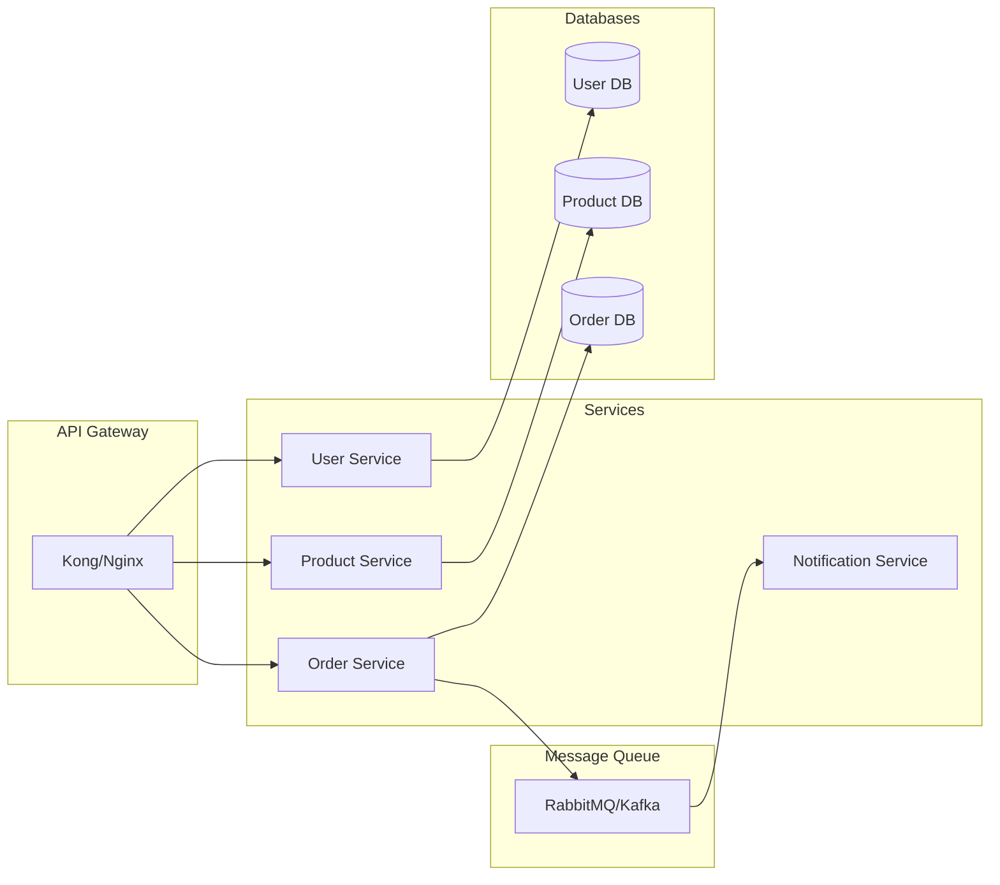

# Architecture Diagram Generator

시스템 아키텍처를 시각화하는 종합 다이어그램을 생성합니다.

## 다이어그램 타입

### 1. Component Diagram
고수준 컴포넌트와 관계를 표시합니다.

### 2. C4 System Context
시스템 컨텍스트와 외부 의존성을 표시합니다.

### 3. Deployment Diagram
인프라 및 배포 아키텍처를 표시합니다.

### 4. Microservices Architecture
마이크로서비스 구조를 표시합니다.

## 작업 프로세스

1. **프로젝트 구조 분석**
   - Filesystem MCP로 프로젝트 파일 읽기
   - 모듈, 서비스, 컴포넌트 식별
   - 의존성 및 데이터 흐름 매핑

2. **다이어그램 타입 선택**
   - Component: 모놀리식 앱
   - C4: 엔터프라이즈 시스템
   - Deployment: 인프라
   - Microservices: 분산 시스템

3. **Mermaid 코드 생성**
   - 적절한 subgraph로 그룹화
   - 명확한 레이블과 관계 표시
   - 데이터 스토어 및 외부 서비스 포함

4. **mermaid-render 스킬로 렌더링**
   - `docs/architecture/` 폴더에 저장
   - SVG와 PNG 버전 생성

## 베스트 프랙티스

- 일관된 네이밍 컨벤션 사용
- 관련 컴포넌트는 subgraph로 그룹화
- 화살표로 데이터 흐름 방향 표시
- 외부 의존성 포함
- 복잡한 다이어그램에는 범례 추가

## 출력 위치

`docs/architecture/` 디렉토리에 저장:
- `component-diagram.svg`
- `deployment-diagram.svg`
- `system-context.svg`
