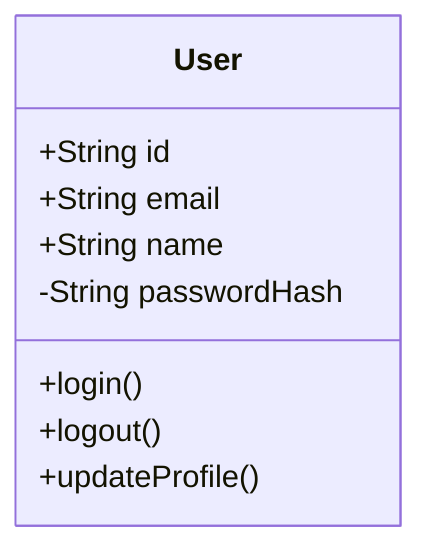
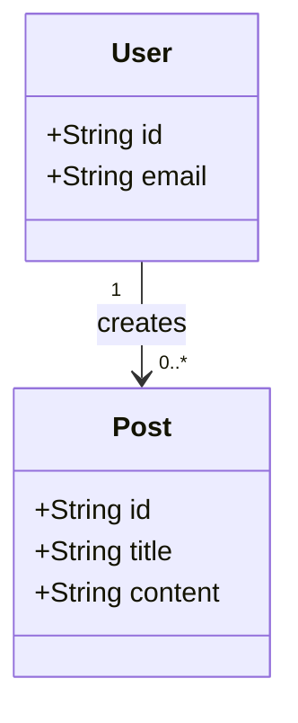
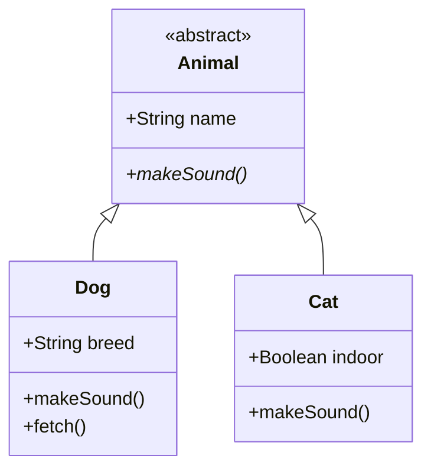
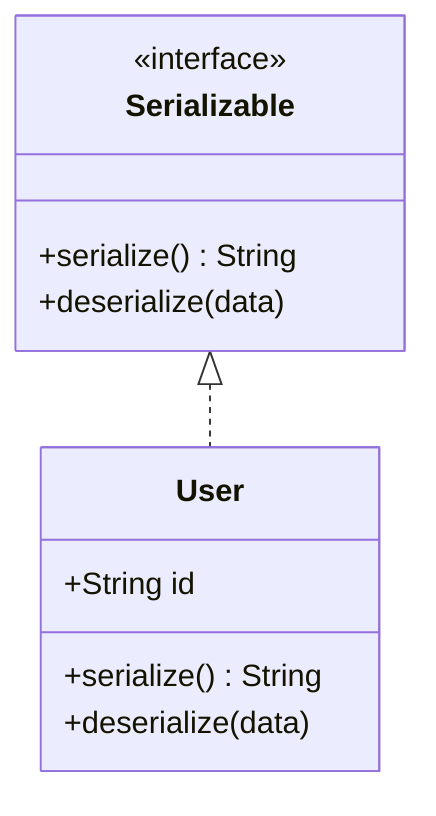
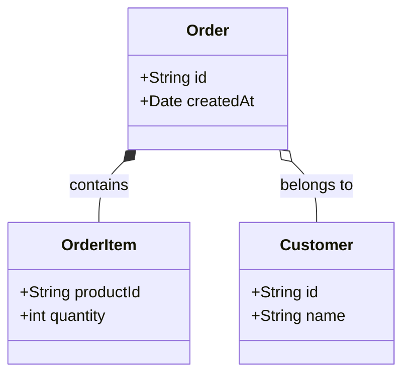
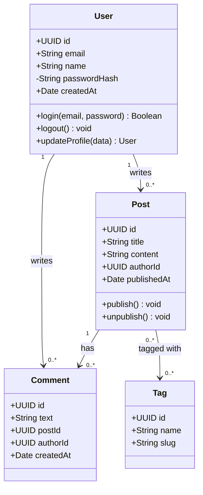
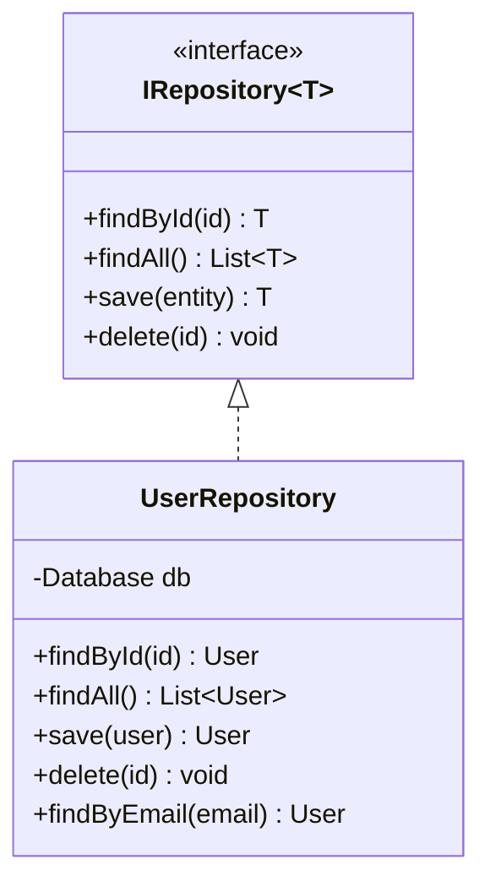
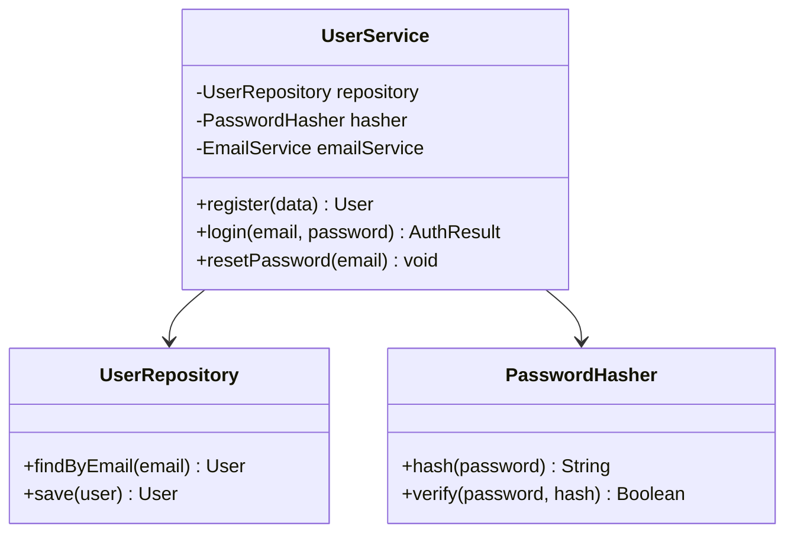

# Class Diagram Generator

객체지향 구조와 관계를 시각화하는 UML 클래스 다이어그램을 생성합니다.

## 기본 문법

## 접근 제한자

| 기호 | 접근성 |
|------|--------|
| `+` | Public |
| `-` | Private |
| `#` | Protected |
| `~` | Package/Internal |

## 관계 타입

### Association (연관)

### Inheritance (상속)

### Interface Implementation

### Composition & Aggregation

## 다중도 (Cardinality)

| 표기 | 의미 |
|------|------|
| `"1"` | 정확히 1개 |
| `"0..1"` | 0개 또는 1개 |
| `"0..*"` | 0개 이상 |
| `"1..*"` | 1개 이상 |
| `"n"` | N개 |

## 완전한 예제

## 디자인 패턴

### Repository Pattern

### Service Layer

## 작업 프로세스

1. **코드 분석**
   - LSP로 클래스/인터페이스 정의 찾기
   - 속성과 메서드 추출
   - 상속, 구성, 집합 관계 식별

2. **다이어그램 생성**
   - 클래스를 Mermaid 문법으로 매핑
   - 다중도와 함께 관계 추가
   - 접근 제한자 포함
   - 관련 클래스 그룹화

3. **렌더링**
   - `mermaid-render` 스킬 사용
   - `docs/design/` 디렉토리에 저장

## 출력 위치

`docs/design/` 디렉토리에 저장:
- `domain-model.svg`
- `service-layer.svg`
- `repository-pattern.svg`
