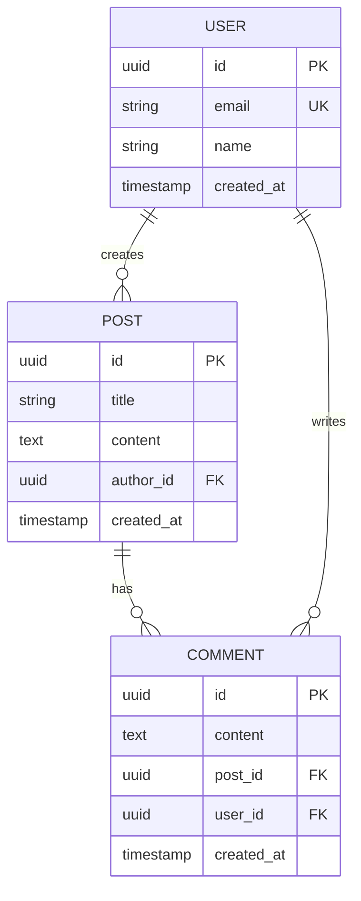
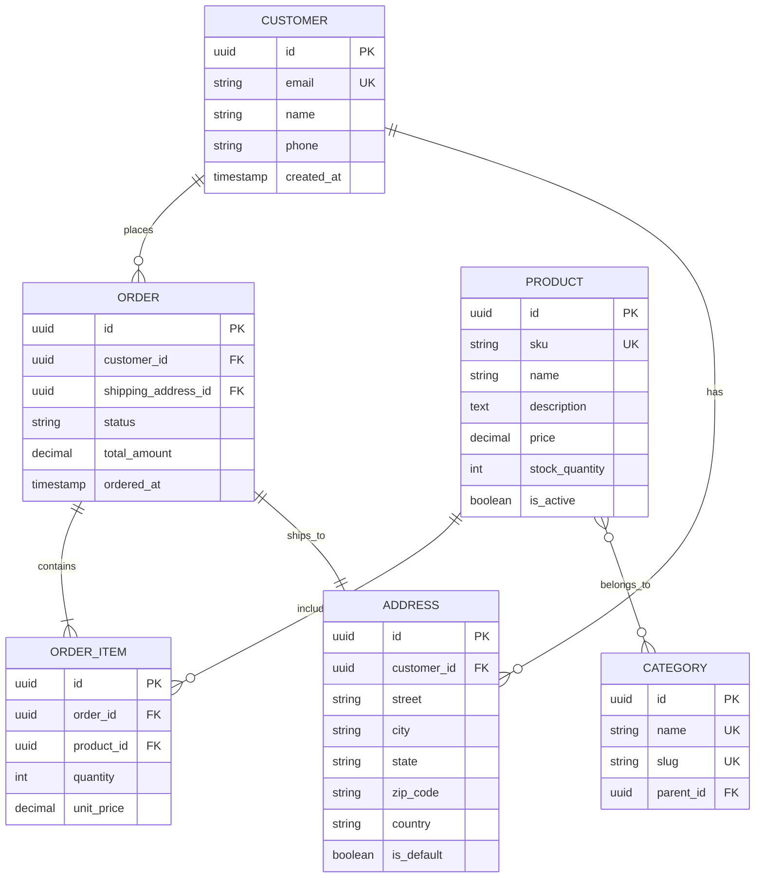
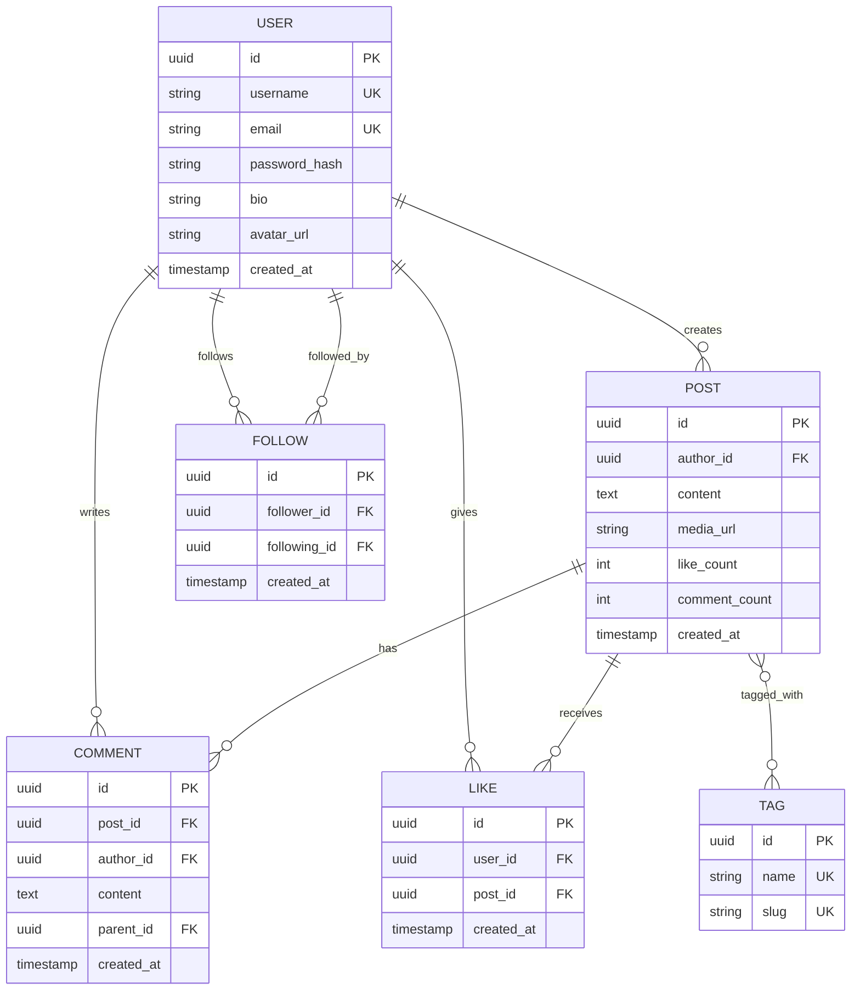

# ER Diagram Generator

데이터베이스 스키마 설계 및 문서화를 위한 ER 다이어그램을 생성합니다.

## 기본 문법



## 관계 타입

| 표기 | 의미 |
|------|------|
| `\|\|--\|\|` | One to one |
| `\|\|--o{` | One to many |
| `}o--o{` | Many to many |
| `\|\|--o\|` | One to zero or one |
| `}\|--\|{` | One or more to one or more |

## 속성 주석

| 주석 | 의미 |
|------|------|
| PK | Primary Key |
| FK | Foreign Key |
| UK | Unique Key |

## 데이터 타입

일반적인 데이터 타입:
- `uuid` - UUID/GUID
- `int` / `bigint` - 정수
- `string` / `varchar` - 텍스트
- `text` - 긴 텍스트
- `boolean` - True/False
- `timestamp` - 날짜와 시간
- `date` - 날짜만
- `decimal` - 십진수
- `json` / `jsonb` - JSON 데이터

## 완전한 예제: E-commerce



## 소셜 미디어 예제



## Design First 워크플로우

데이터베이스가 없을 때:

1. **요구사항 수집**
   - 사용자 스토리에서 엔티티 식별
   - 각 엔티티의 속성 나열
   - 관계 정의

2. **정규화**
   - 1NF, 2NF, 3NF 적용
   - 중복 제거
   - 참조 무결성 확인

3. **ER 다이어그램 생성**
   - Mermaid 코드 작성
   - mermaid-render 스킬로 렌더링

4. **DDL 생성 (선택)**
   다이어그램 승인 후 SQL 생성:
   ```sql
   CREATE TABLE users (
       id UUID PRIMARY KEY DEFAULT gen_random_uuid(),
       email VARCHAR(255) UNIQUE NOT NULL,
       name VARCHAR(255) NOT NULL,
       created_at TIMESTAMP DEFAULT CURRENT_TIMESTAMP
   );
   ```

## 코드에서 추출 워크플로우

ORM 엔티티가 있을 때:

1. **엔티티 정의 찾기**
   - Prisma 스키마, TypeORM 엔티티 등 검색
   - 데코레이터와 타입 추출

2. **스키마 추출**
   - 속성을 컬럼으로 매핑
   - 데코레이터를 제약조건으로 매핑
   - 관계를 관계선으로 매핑

3. **ER 다이어그램 생성**
   - Mermaid 표현으로 변환
   - SVG로 렌더링

## ORM 예제

### Prisma 스키마

```prisma
model User {
  id        String   @id @default(uuid())
  email     String   @unique
  posts     Post[]
}

model Post {
  id       String @id @default(uuid())
  title    String
  author   User   @relation(fields: [authorId], references: [id])
  authorId String
}
```

### TypeORM Entity

```typescript
@Entity()
class User {
  @PrimaryGeneratedColumn('uuid')
  id: string;

  @Column({ unique: true })
  email: string;

  @OneToMany(() => Post, post => post.author)
  posts: Post[];
}
```

## 출력 위치

`docs/database/` 디렉토리에 저장:
- `schema-design.svg`
- `entity-relationships.svg`
