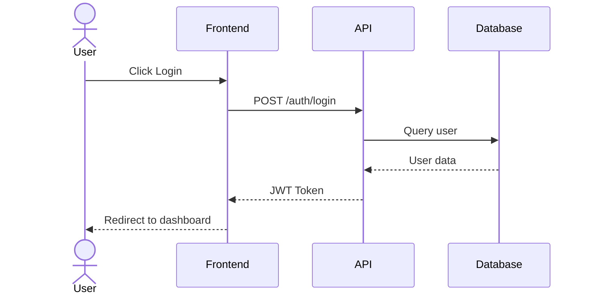
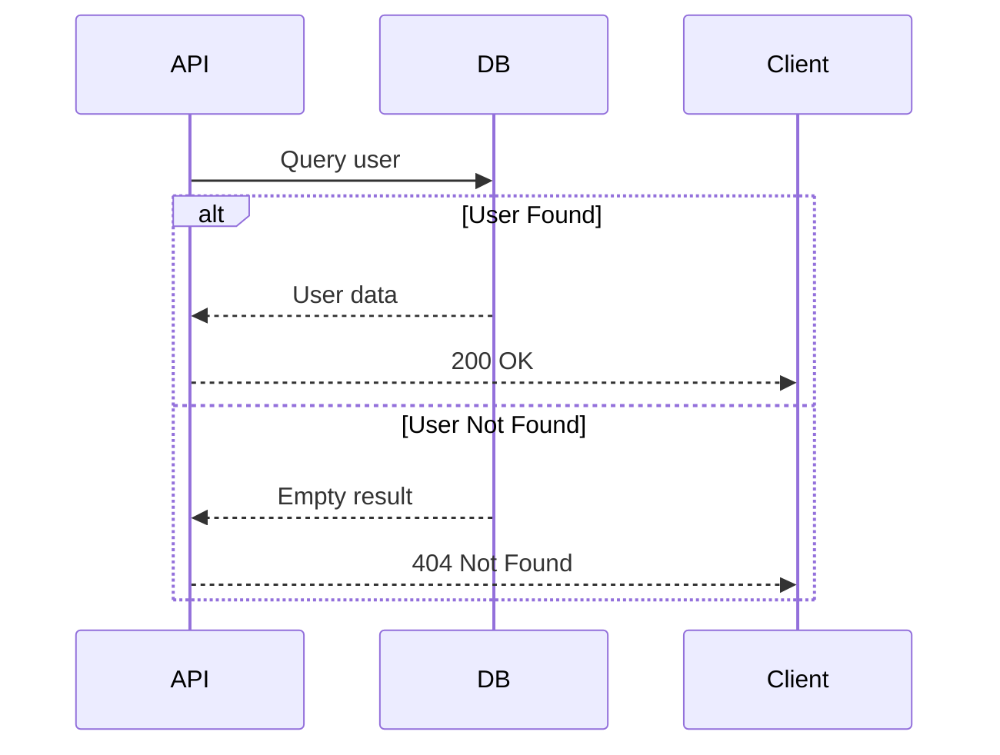
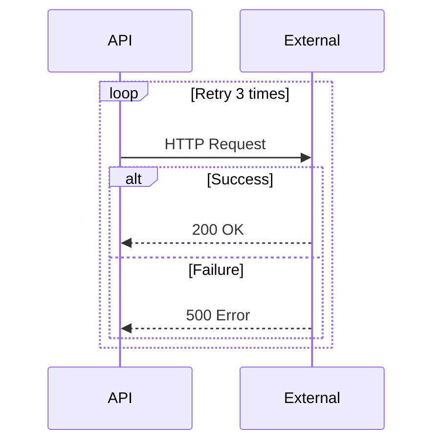
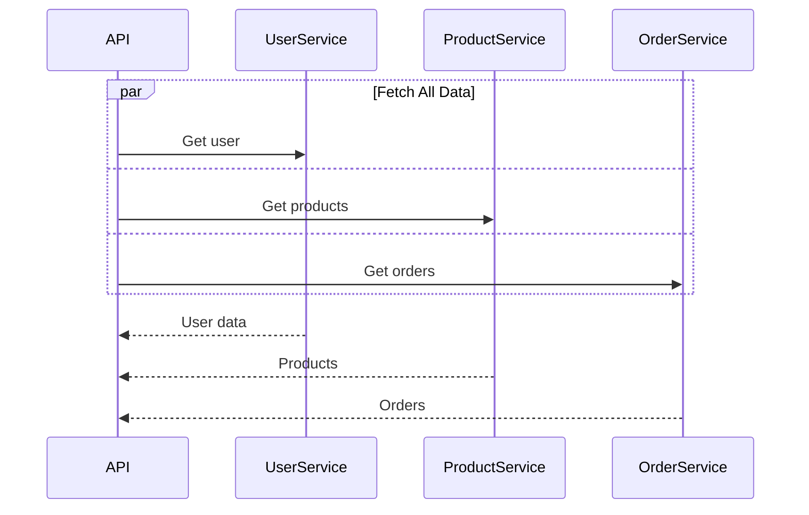
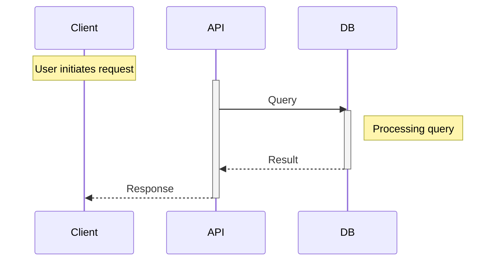
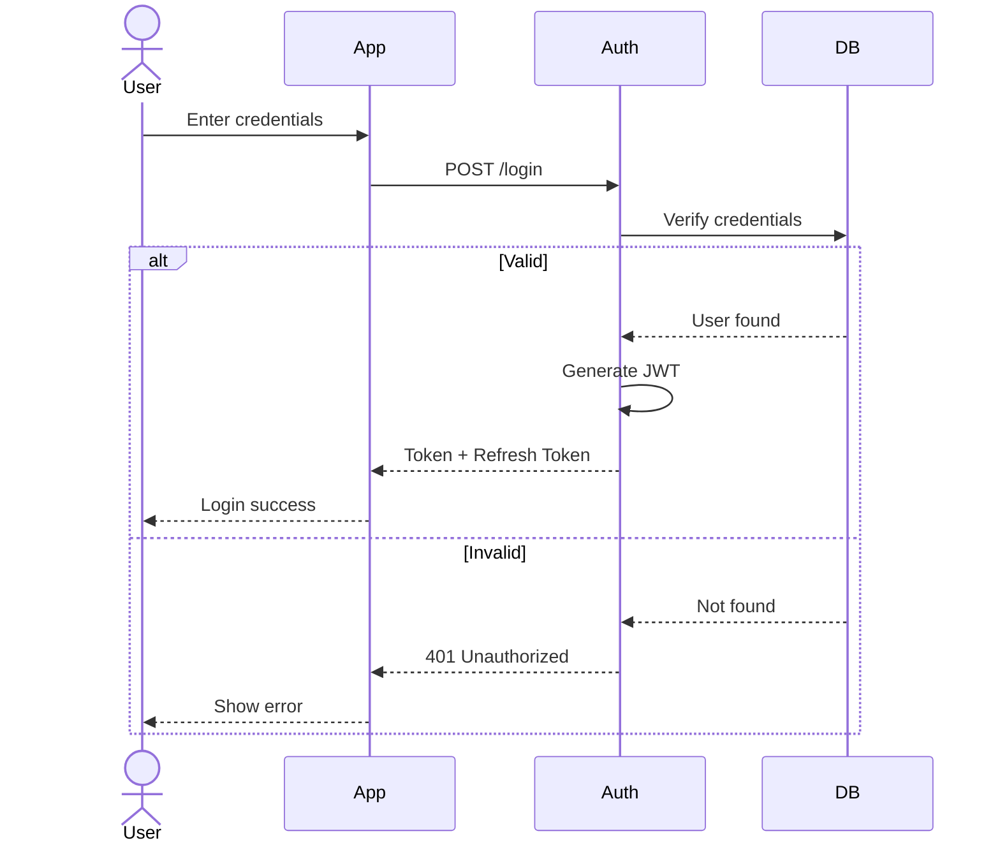
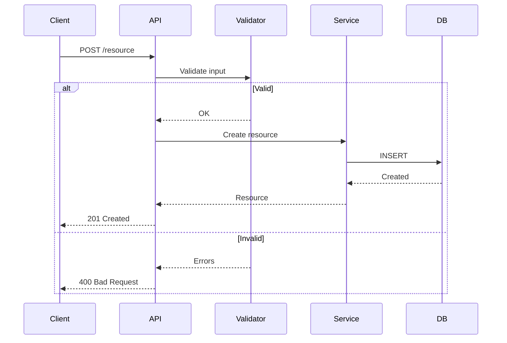

# Sequence Diagram Generator

시스템 상호작용을 이해하기 위한 상세한 시퀀스 다이어그램을 생성합니다.

## 사용 사례

1. **API Request Flow** - User → API → Database → Response
2. **Authentication Flow** - 로그인, JWT 검증, 토큰 갱신
3. **Microservice Communication** - 서비스 간 호출
4. **Webhook Processing** - 외부 이벤트 처리
5. **Error Handling** - 재시도 로직, 폴백 메커니즘

## 기본 문법

## 고급 기능

### 조건 로직 (alt/else)

### 반복 (Loop)

### 병렬 실행 (Parallel)

### 노트와 활성화

## 일반적인 패턴

### 인증 플로우

### CRUD 작업

## 작업 프로세스

1. **플로우 식별**
   - 사용자에게 어떤 API/기능을 문서화할지 질문
   - 또는 코드를 분석하여 주요 엔드포인트 찾기

2. **실행 추적**
   - LSP로 함수 호출 찾기
   - 레이어 간 데이터 흐름 추적
   - 비동기 작업, 에러 처리 식별

3. **다이어그램 생성**
   - 코드 플로우를 Mermaid 문법으로 매핑
   - actor, participant, 메시지 포함
   - 제어 흐름에 alt/loop/par 블록 추가

4. **렌더링 및 저장**
   - `mermaid-render` 스킬 사용
   - `docs/flows/` 디렉토리에 저장

## 화살표 타입

| 화살표 | 의미 |
|--------|------|
| `->>` | 동기 호출 |
| `-->>` | 동기 응답 |
| `-)` | 비동기 메시지 |
| `--x` | 손실된 메시지 |

## 출력 위치

`docs/flows/` 디렉토리에 저장:
- `auth-flow.svg`
- `order-creation.svg`
- `payment-processing.svg`
